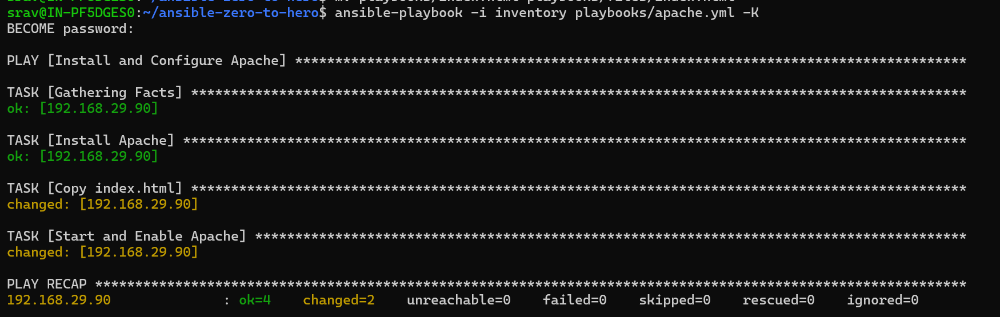
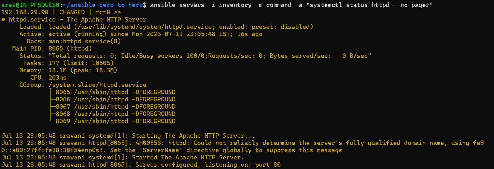
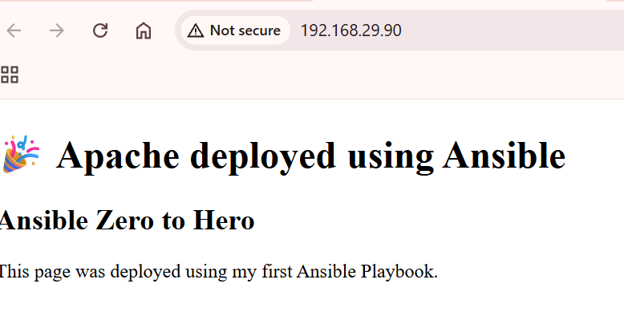
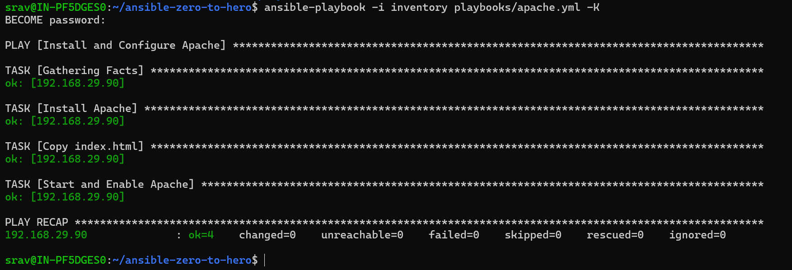

# Apache Deployment using Ansible Playbook

## Objective

Learn how to automate Apache HTTP Server deployment using an Ansible Playbook by installing the package, copying a web page, and starting the Apache service.

---

## Scenario

Instead of executing multiple Ad Hoc commands manually, we automate the complete deployment using a single Ansible Playbook.

The playbook performs the following tasks:

- Install Apache HTTP Server
- Copy a static HTML page
- Start the Apache service
- Enable the service at system boot

---

# Playbook Used

```yaml
---
- name: Install and Configure Apache
  hosts: servers
  become: true

  tasks:

    - name: Install Apache
      ansible.builtin.dnf:
        name: httpd
        state: present

    - name: Copy index.html
      ansible.builtin.copy:
        src: files/index.html
        dest: /var/www/html/index.html
        owner: root
        group: root
        mode: "0644"

    - name: Start and Enable Apache
      ansible.builtin.service:
        name: httpd
        state: started
        enabled: true
```

---

# Playbook Explanation

## `hosts: servers`

Specifies the inventory group on which the playbook will execute.

---

## `become: true`

Executes the tasks with elevated (root) privileges.

Administrative operations such as installing packages, copying files to system directories, and managing services require root access.

---

## Task 1: Install Apache

```yaml
ansible.builtin.dnf:
  name: httpd
  state: present
```

### Module

`dnf`

### Purpose

Installs the Apache HTTP Server package if it is not already installed.

### Parameters

| Parameter | Description |
|----------|-------------|
| name | Package name (`httpd`) |
| state | `present` ensures the package is installed |

---

## Task 2: Copy HTML File

```yaml
ansible.builtin.copy:
```

### Purpose

Copies the HTML file from the Ansible Controller to the managed node.

### Parameters

| Parameter | Description |
|----------|-------------|
| src | Source file on the controller |
| dest | Destination on the managed node |
| owner | File owner |
| group | File group |
| mode | File permissions |

---

## Task 3: Start Apache Service

```yaml
ansible.builtin.service:
```

### Purpose

Starts the Apache service and enables it to start automatically during system boot.

### Parameters

| Parameter | Description |
|----------|-------------|
| name | Service name (`httpd`) |
| state | `started` starts the service |
| enabled | `true` enables the service after reboot |

---

# Execution Command

```bash
ansible-playbook -i inventory playbooks/apache.yml -K
```

`-K` prompts for the sudo password because the playbook uses `become: true`.

---

# First Execution

```text
PLAY RECAP

ok=4
changed=2
failed=0
```

## Why `changed=2`?

The following tasks modified the managed node:

- Copied `index.html`
- Started and enabled the Apache service

The Apache package was already installed, so no changes were required for that task.

---

# Verification

Check the Apache service:

```bash
ansible servers -i inventory -m command -a "systemctl status httpd --no-pager"
```

Expected result:

```text
Active: active (running)
```

Open a browser and access:

```text
http://192.168.29.90
```

The deployed web page should display:

```
Apache deployed using Ansible

Ansible Zero to Hero
```

---

# Running the Playbook Again

```bash
ansible-playbook -i inventory playbooks/apache.yml -K
```

Output:

```text
PLAY RECAP

ok=4
changed=0
failed=0
```

---

# What is Idempotency?

Idempotency means running the same playbook multiple times produces the same final state without making unnecessary changes.

Ansible compares the current state of the managed node with the desired state defined in the playbook.

If the system already matches the desired state, Ansible reports `ok` instead of `changed`.

---

# Execution Flow

```text
Controller Node
        │
        ▼
Read Playbook
        │
        ▼
Connect to Managed Node
        │
        ▼
Gather Facts
        │
        ▼
Install Apache
        │
        ▼
Copy index.html
        │
        ▼
Start Apache Service
        │
        ▼
Verify Deployment
```

---

# Key Learnings

- Created a multi-task Ansible Playbook.
- Used the `dnf` module to manage packages.
- Used the `copy` module to deploy files.
- Used the `service` module to manage services.
- Learned the purpose of `become: true`.
- Verified Apache deployment.
- Understood Ansible idempotency.

---

# Common Mistakes

- Incorrect inventory path.
- Missing `become: true`.
- Incorrect source file path.
- Apache service name mismatch.
- Firewall blocking HTTP traffic.

---

# Troubleshooting

## Apache Service Not Running

```bash
systemctl status httpd
```

---

## Web Page Not Accessible

Verify firewall configuration:

```bash
sudo firewall-cmd --list-all
```

Allow HTTP if required:

```bash
sudo firewall-cmd --permanent --add-service=http
sudo firewall-cmd --reload
```

---

## Copy Module Failed

Verify that the source file exists:

```text
playbooks/files/index.html
```

---

# Interview Notes

## Q1. Why is `become: true` required?

It allows Ansible to execute tasks with root privileges.

---

## Q2. What does `state: present` mean?

It ensures the package is installed without reinstalling it if it already exists.

---

## Q3. What does `enabled: true` do?

It configures the service to start automatically during system boot.

---

## Q4. What is idempotency?

Idempotency means running the same playbook multiple times results in the same desired system state without unnecessary modifications.

---

## Q5. Why did the second playbook execution show `changed=0`?

Because the system already matched the desired configuration. No additional changes were required.

---

# Next Step

The next chapter introduces **Ansible Variables**, allowing playbooks to become reusable and configurable

---

# Screenshots

## First Playbook Execution



---

## Apache Service Running



---

## Deployed Web Page



---

## Idempotency Demonstration

.
